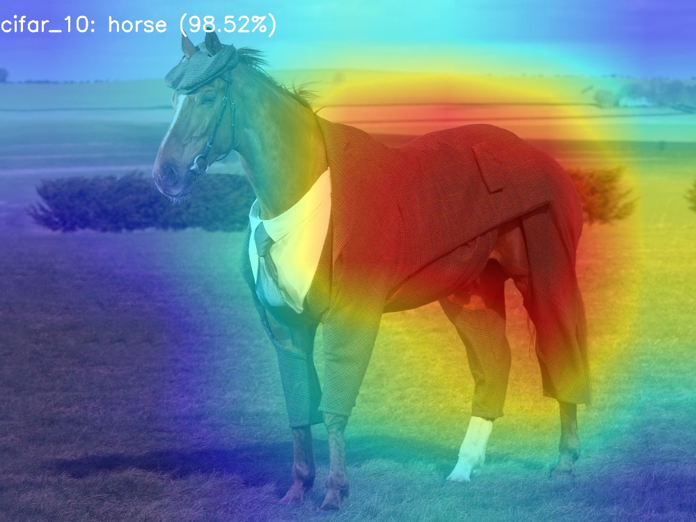
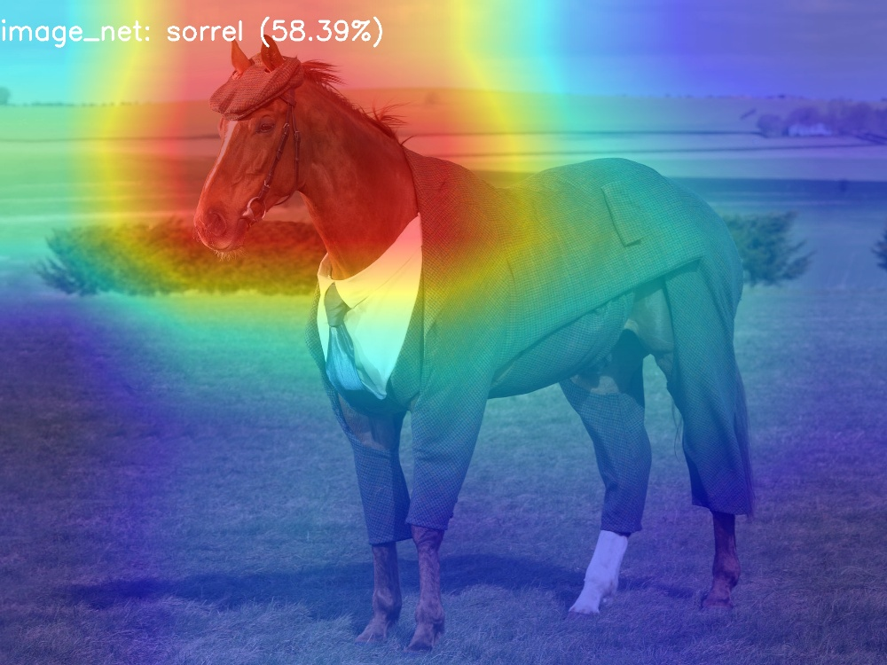
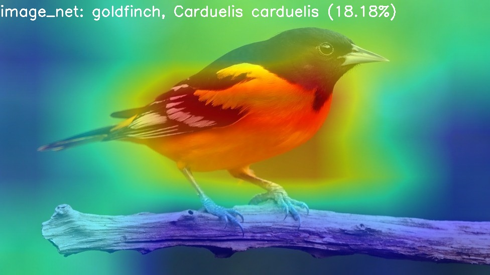
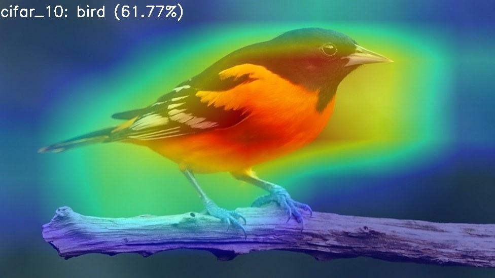
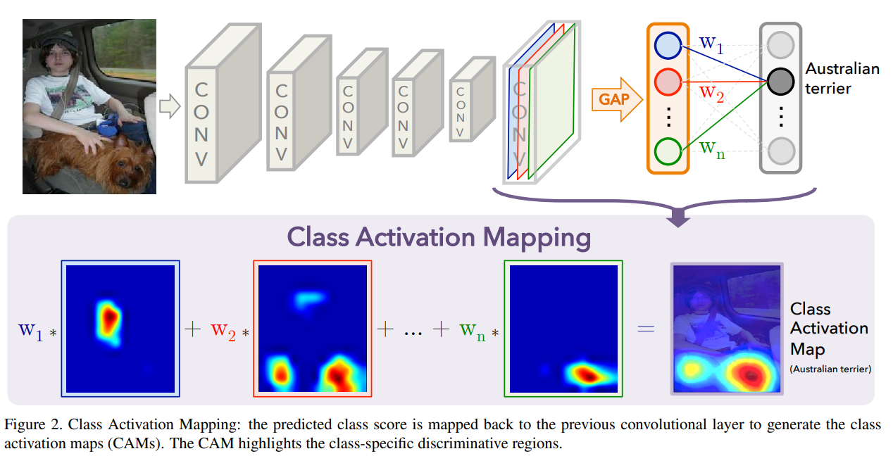
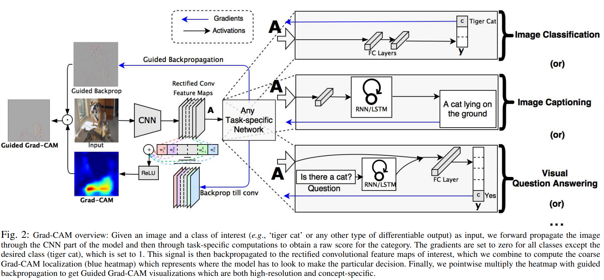

# CNNs Visualization using CAM, gradCAM or gradCAM++
Using Grad, Grad-CAM or Grad-CAM++ for visualizing feature maps of Deep Convolutional Networks

## Reference
[1] CAM: [Learning Deep Features for Discriminative Localization](https://arxiv.org/pdf/1512.04150.pdf)\
[2] GradCAM: [Visual Explanations from Deep Networks via Gradient-based Localization](https://arxiv.org/pdf/1610.02391.pdf)\
[3] Grad-CAM++: [Improved Visual Explanations for Deep Convolutional Networks](https://arxiv.org/pdf/1710.11063.pdf)

## Project Structure
```
CNNs_visualization_pytorch
                    |
                    ├── application
                    |	    ├── templates
                    |     |  	  └── home.html
                    |	    └── flask.py
                    |
                    ├── models
                    |	    ├── definitions  # including all definition of models
                    |	    └── weights      # including all trained weights for loading into models.
                    |
                    ├── modules
                    |	    ├── CAM
                    |     |     ├── class_activation_map.py
                    |     |  	  └── config.yaml
                    |	    ├── gradCAM
                    |     |     ├── gradCAM.py
                    |     |  	  └── config.yaml
                    |     └── gradCAMpp
                    |           ├── gradCAMpp.py
                    |       	  └── config.yaml
                    ├── run.py
                    └── utils.py
```

## Usage

> CAM, Grad-CAM using model which is trained with custom model and cifar 10 dataset (10 classes).
* **CAM**
```bash
python run.py <image_path> --show-image --config-path module/CAM/config.yaml --module-name cifar_10
python run.py <image_dir> --pattern <image_pattern> --show-image --config-path module/CAM/config.yaml --module-name cifar_10
```
* **Grad-CAM**
```bash
python run.py <image_path> --show-image --config-path module/gradCAM/config.yaml --module-name cifar_10
python run.py <image_dir> --pattern <image_pattern> --show-image --config-path module/gradCAM/config.yaml --module-name cifar_10
```

> CAM, Grad-CAM using ```torchvision.models.resnet18``` with pretrained weight and imagenet dataset (1000 classes).
* **CAM**
```bash
python run.py <image_path/image_dir> --show-image --config-path module/CAM/config.yaml --module-name image_net
python run.py <image_dir> --pattern <image_pattern> --show-image --config-path module/CAM/config.yaml --module-name image_net
```
* **Grad-CAM**
```bash
python run.py <image_path> --show-image --config-path module/gradCAM/config.yaml --module-name image_net
python run.py <image_dir> --pattern <image_pattern> --show-image --config-path module/gradCAM/config.yaml --module-name image_net
```

## Results
| Method | CIFAR 10 | IMAGE NET |
| ---         |     ---      |          --- |
| CAM |      |     |
| grad-CAM |      |     |
| CAM |      |     |
| grad-CAM |      |     |

## TODO
 - [x] Adding Class Activation Map method for visualizing the last convolutional layer in CNNs with AveragePooling.
 - [x] Adding Grad-CAM method for visualizing any convolutional layer in CNNs.
 - [ ] Applying GuidedBackprop method which is proposed in paper[2].
 - [ ] Applying grad-CAM++ method which is proposed in paper[3].

## Explainations

#### CAM <Updating>
<div align="center">
  
</div>

#### Grad-CAM <Updating>
<div align="center">
  
</div>

#### Grad-CAM++ <Updating>

## Contributor
*Xuan-Phung Pham*
